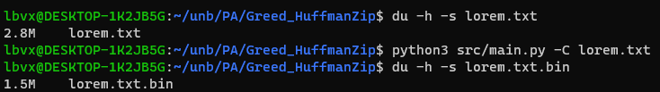

# vovozip

**Conteúdo da Disciplina**: Greed<br>

## Alunos
| Matrícula | Aluno |
| -- | -- |
| 19/0014032  | Guilherme Rogelin Vial |
| 19/0033088  | Lucas Braun Vieira Xavier |

## [Vídeo]()

## Sobre

Essa é uma implementação de um algoritmo que aplica a Codificação de Huffman para comprimir e descomprimir arquivos sem perda, com foco em exibir quais foram os códigos prefixos gerados.

## Screenshots

Compressão de arquivo de texto:



Códigos prefixos gerados:


## Instalação e execução

Com Python 3 instalado na máquina, basta rodar a *main.py*. Para comprimir:
```
python3 src/main.py -C nome_arquivo
```
Será gerado um novo arquivo com nome *nome_arquivo.bin*, que é o arquivo comprimido, e o arquivo *codes.txt*, que possui os códigos prefixos gerados para cada byte do arquivo original.

Para descomprimir:
```
python3 src/main.py -X nome_comprimido
```
E será gerado um novo arquivo, que é o arquivo descomprimido.
